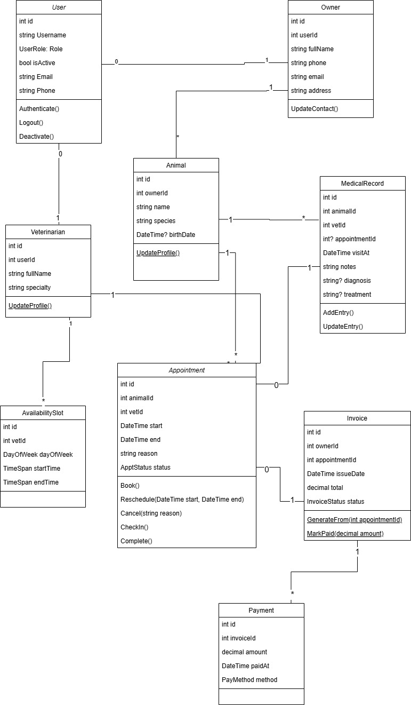
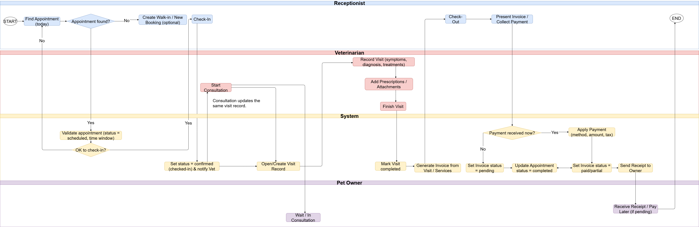
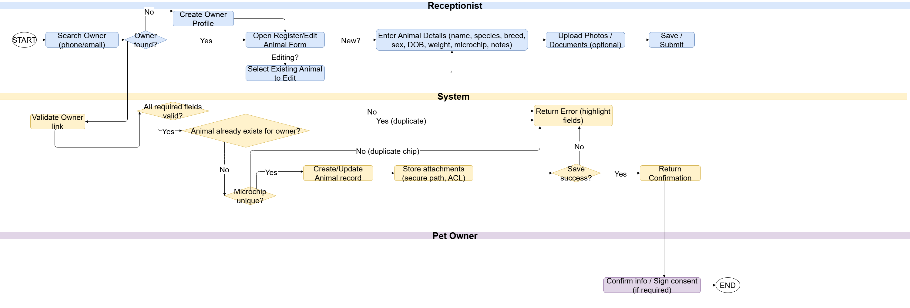
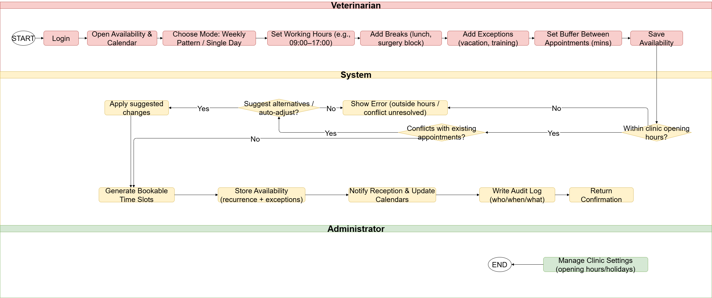
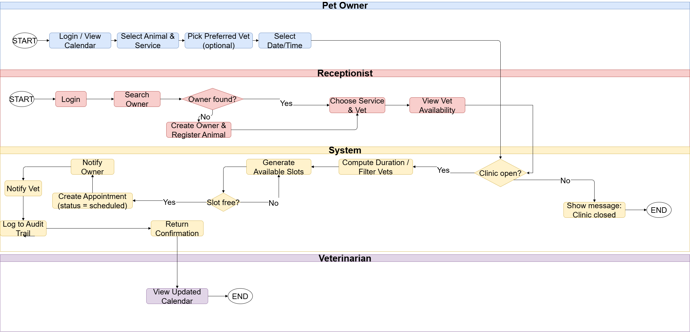
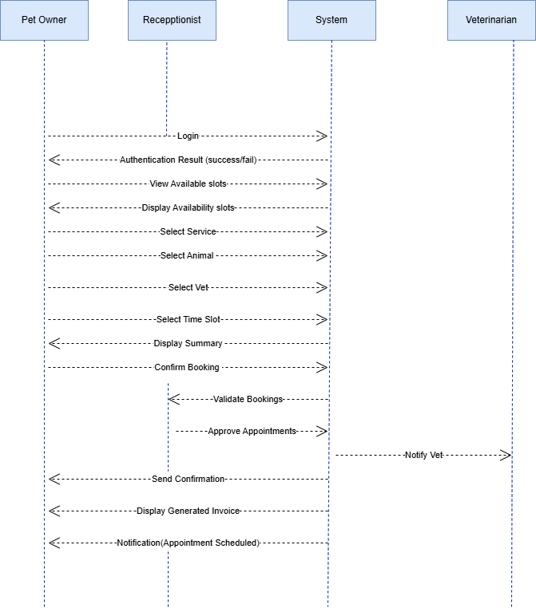
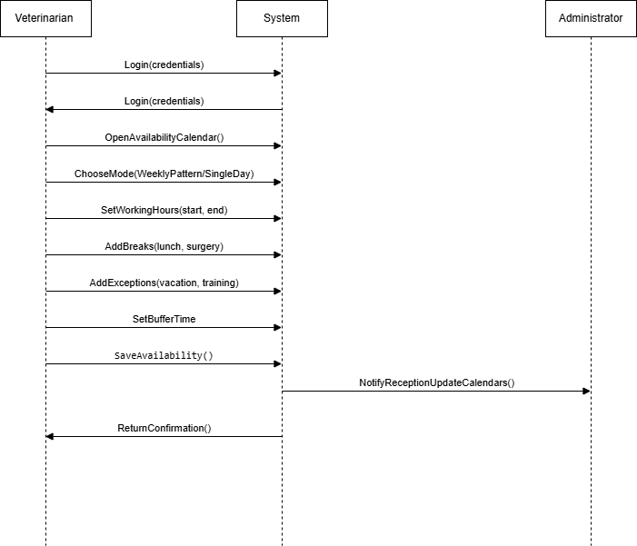
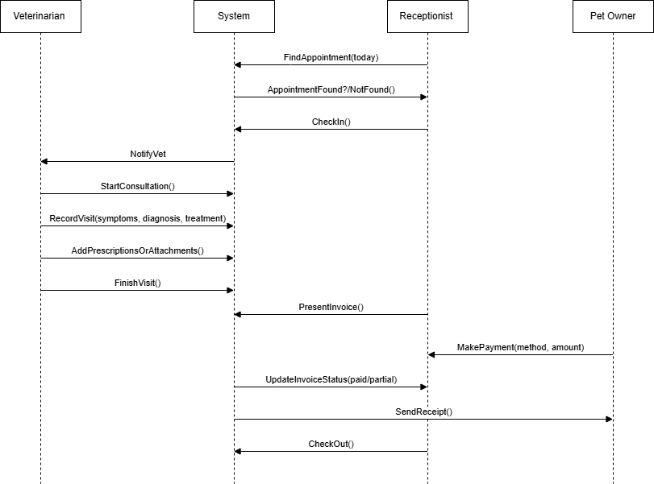
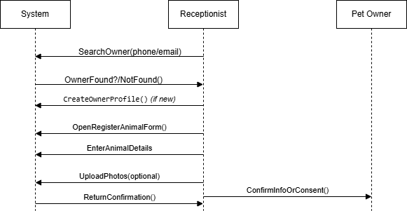

# 🐾 Animal-Care Veterinary Clinic Management System

A centralized **web application** for managing the operations of a veterinary clinic, from patient registration to visit scheduling, treatment tracking, and billing.  
This project follows the full **Software Development Life Cycle (SDLC)** and is divided into **three deliverables**:

- **Part I - Information System Analysis & Design (UML)**
- **Part II - Database Design & Implementation (ERD | RDM | SQL)**
- **Part III - Web Server Application (ASP.NET)**

---
## 👥 Team

**Negar Pirasteh** • **Betty Dang** • **Hope Jeanine Ukundimana** • **Ngoc Yen Nhi Pham**

---


## 🧩 Part I — Information System Analysis & Design

📘 **Full report:** [Project Part 1 - System Analysis and Design (PDF)](Project%20part%201%201.pdf)

This part focuses on understanding the clinic’s workflow, defining system objectives, and modeling functionality using **UML diagrams**.

### 🔹 System Overview
The system simplifies daily clinic operations by providing modules for:
- Managing client and animal records  
- Scheduling and tracking veterinary appointments  
- Recording medical treatments and invoices  
- Managing veterinarian availability and clinic operations

### 🔹 Objectives
- Improve accuracy of record-keeping and scheduling  
- Automate repetitive administrative work  
- Provide secure access for different roles (Admin, Veterinarian, Receptionist, Pet Owner)  
- Enhance service efficiency and reduce client wait times

### 🔹 Actors and Roles
| Actor | Description |
|:--|:--|
| **Administrator** | Manages users, system data, and reports |
| **Receptionist** | Registers owners/animals, books appointments |
| **Veterinarian** | Reviews cases, records treatments, sets availability |
| **Pet Owner** | Manages pet info, views appointments and invoices |

---

## 📊 UML Diagrams — Part I

Each diagram below is a simplified preview.  
For detailed explanations, refer to the [full Part I PDF](Project%20part%201%201.pdf).

### 1. Use Case Diagrams
#### General Use Case
All actors and high-level functions.  


#### Specific Use Case
Receptionist booking flow, vet availability, admin reporting.  


---

### 2. Class Diagram
Static structure of system entities — **User, Owner, Animal, Veterinarian, Appointment, Availability, MedicalRecord, Invoice, Payment.**  
It provides the foundation for the database schema.  


---

### 3. Activity Diagrams
#### Activity 1 – Check-In → Visit → Check-Out  
Describes the entire visit cycle from reception to billing.  


#### Activity 2 – Register / Edit Animal  
Creating or updating animal data linked to an owner.  


#### Activity 3 – Set Veterinarian Availability  
Vets define weekly schedules, breaks, and holidays.  


#### Activity 4 – Schedule Appointment  
Receptionist books visits; system validates time conflicts.  


---

### 4. Sequence Diagrams
Show dynamic message flow between objects.

| # | Scenario | Preview |
|:-:|:--|:--|
| 1 | Schedule Appointment |  |
| 2 | Set Vet Availability |  |
| 3 | Check-In / Check-Out |  |
| 4 | Register / Edit Animal |  |

---

## 🗄️ Part II — Database Design & Implementation (Completed)

### 🔹 Database Technology

* **Microsoft SQL Server 2022**
* **Entity Framework Core**
* **Database First (Scaffolding)**

### 🔹 Implemented Entities

* UserAccount
* Owner
* Animal
* Veterinarian
* Schedule
* Appointment
* VisitHistory

### 🔹 Key Design Decisions

* **Schedule** represents veterinarian availability (date + time slot)
* **Appointment** represents a booking linked to a schedule and an animal
* **VisitHistory** represents the medical outcome of an appointment
* Appointment status (`Booked`, `Cancelled`, `Completed`) preserves history and supports reporting

### 🔹 Database Schema

* SQL creation script included in:

```
Database Schema/
└── Animal-ClinicDB_T1.sql
```

---

## 💻 Part III — Web Server Application (Completed)

### 🔹 Technology Stack

* **ASP.NET Core MVC**
* **Entity Framework Core**
* **SQL Server**
* **Bootstrap 5**
* **Cookie-based Authentication**

### 🔐 Authentication & Authorization

* Login system using `UserAccounts` table
* Role-based access using `[Authorize]`
* Roles:

  * Admin
  * Secretary
  * Veterinarian
* No self-registration → **Admin creates user accounts**

---

### 🔹 Core Functionalities

#### 🐶 Animal & Owner Management

* Full CRUD operations
* Linked owner–animal relationship
* Validated input with client & server-side validation

#### 📅 Scheduling System

* **Schedule** defines veterinarian availability
* **Appointments** must use available schedules
* Prevents double booking

#### ❌ Appointment Cancellation

* Admin and Secretary can cancel appointments
* Cancellation updates status instead of deleting data
* Cancelled appointments remain visible for reports

#### 🩺 Visit History

* Created after an appointment
* Recorded by Veterinarian or Admin
* Used for workload calculations

---

### 📊 Monthly Administrative Reports (Admin Only)

Implemented via `ReportsController` and ViewModels.

Reports include:

* Total appointments per month
* Number of:

  * Booked appointments
  * Cancelled appointments
  * Completed appointments
* Veterinarian workload (based on VisitHistory)

Accessible from the **navigation bar (Admin only)**.

---

### 🧪 Testing (Completed)

* Manual testing of **all CRUD operations** for every entity:

  * Insert
  * Edit
  * Delete
  * List
* Test results documented in:

  * `Animal-Clinic_Test Plan.docx`
  * `Animal-Clinic_Test Plan.pdf`

---

## 📄 Documentation (Completed)

The `Documentation` folder contains:

* Technical documentation
* Test Plan (Word + PDF)
* UML diagrams
* Database schema

Each controller action includes:

* **Pre-condition**
* **Post-condition**
* Inline code comments

---

## 📁 Repository Structure

```
AnimalCareClinic/
│
├── Documentation/
│   ├── Diagrams/
│   ├── TechnicalDocumentation.docx
│   ├── Animal-Clinic_Test Plan.docx
│   └── Animal-Clinic_Test Plan.pdf
│
├── Database Schema/
│   └── Animal-ClinicDB_T1.sql
│
├── AnimalCareClinic/        # ASP.NET Core MVC app
│
├── Project part 1 1.pdf     # Part I – UML & Analysis
└── README.md
```

---

