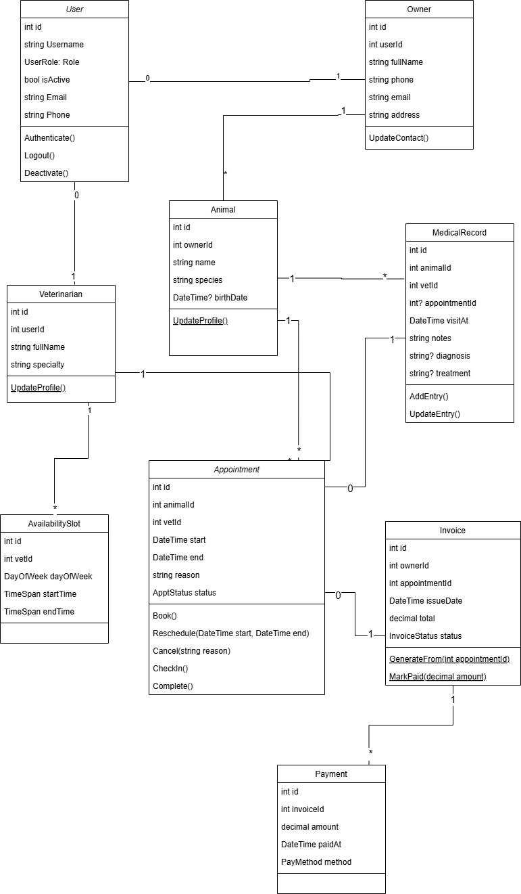
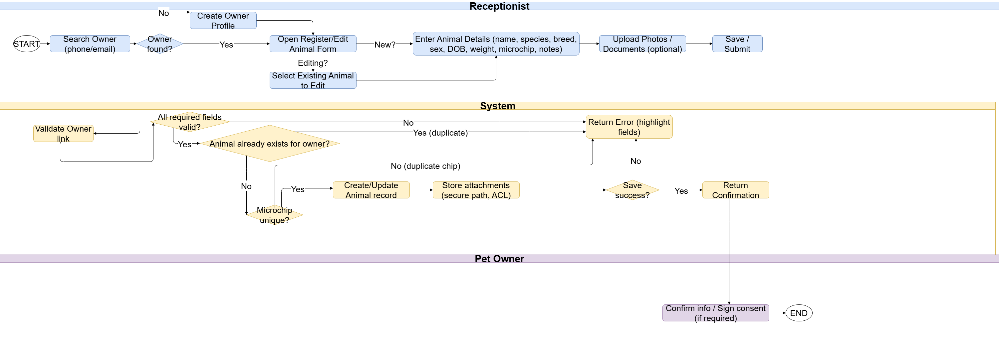
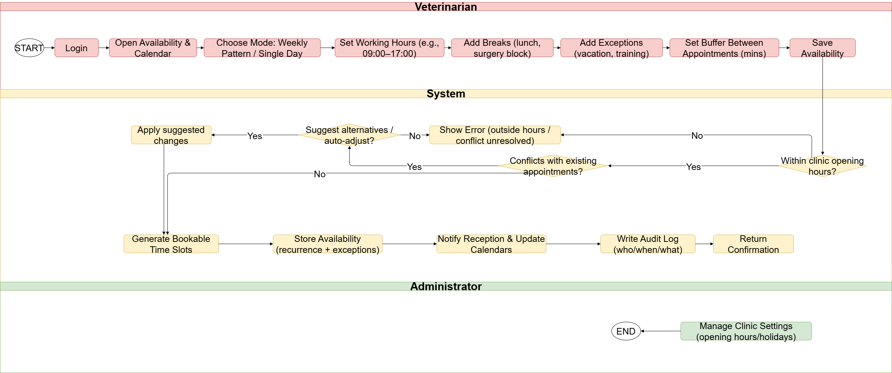
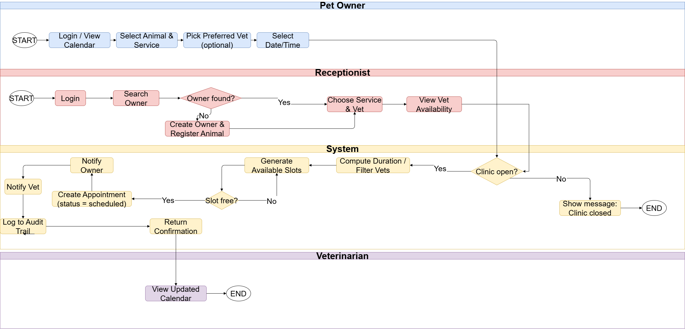
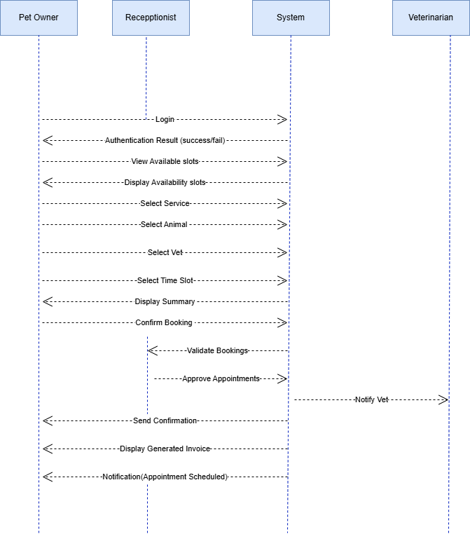
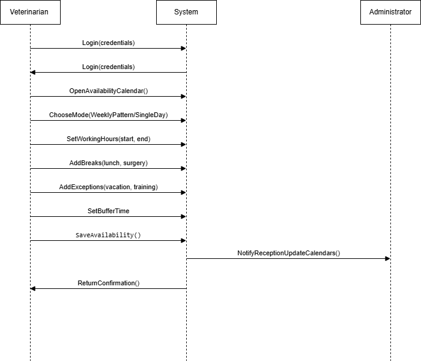
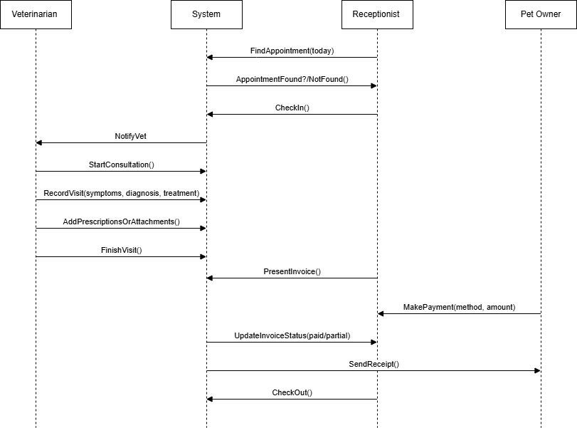
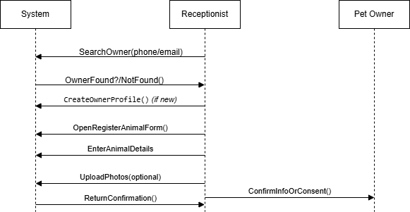

# 🐾 Animal-Care Veterinary Clinic Management System

A centralized **web application** for managing the operations of a veterinary clinic — from patient registration to visit scheduling, treatment tracking, and billing.  
This project follows the full **Software Development Life Cycle (SDLC)** and is divided into **three deliverables**:

- **Part I — Information System Analysis & Design (UML)**
- **Part II — Database Design & Implementation (ERD | RDM | SQL)**
- **Part III — Web Server Application (ASP.NET)**

---
## 👥 Team

**Negar Pirasteh** • **Betty Dang** • **Hope Jeanine Ukundimana** • **Ngoc Yen Nhi Pham**

---


## 🧩 Part I — Information System Analysis & Design

📘 **Full report:** [Project Part 1 – System Analysis and Design (PDF)](Project%20part%201%201.pdf)

This part focuses on understanding the clinic’s workflow, defining system objectives, and modeling functionality using **UML diagrams**.

### 🔹 System Overview
The system simplifies daily clinic operations by providing modules for:
- Managing client and animal records  
- Scheduling and tracking veterinary appointments  
- Recording medical treatments and invoices  
- Managing veterinarian availability and clinic operations

### 🔹 Objectives
- Improve accuracy of record-keeping and scheduling  
- Automate repetitive administrative work  
- Provide secure access for different roles (Admin, Veterinarian, Receptionist, Pet Owner)  
- Enhance service efficiency and reduce client wait times

### 🔹 Actors and Roles
| Actor | Description |
|:--|:--|
| **Administrator** | Manages users, system data, and reports |
| **Receptionist** | Registers owners/animals, books appointments |
| **Veterinarian** | Reviews cases, records treatments, sets availability |
| **Pet Owner** | Manages pet info, views appointments and invoices |

---

## 📊 UML Diagrams — Part I

Each diagram below is a simplified preview.  
For detailed explanations, refer to the [full Part I PDF](Project%20part%201%201.pdf).

### 1. Use Case Diagrams
#### General Use Case
All actors and high-level functions.  


#### Specific Use Case
Receptionist booking flow, vet availability, admin reporting.  


---

### 2. Class Diagram
Static structure of system entities — **User, Owner, Animal, Veterinarian, Appointment, Availability, MedicalRecord, Invoice, Payment.**  
It provides the foundation for the database schema.  


---

### 3. Activity Diagrams
#### Activity 1 – Check-In → Visit → Check-Out  
Describes the entire visit cycle from reception to billing.  


#### Activity 2 – Register / Edit Animal  
Creating or updating animal data linked to an owner.  


#### Activity 3 – Set Veterinarian Availability  
Vets define weekly schedules, breaks, and holidays.  


#### Activity 4 – Schedule Appointment  
Receptionist books visits; system validates time conflicts.  


---

### 4. Sequence Diagrams
Show dynamic message flow between objects.

| # | Scenario | Preview |
|:-:|:--|:--|
| 1 | Schedule Appointment |  |
| 2 | Set Vet Availability |  |
| 3 | Check-In / Check-Out |  |
| 4 | Register / Edit Animal |  |

---

## 🗄️ Part II — Database Design & Implementation

> *Coming next phase.*

Will include:
- **Entity–Relationship Diagram (ERD)**  
- **Relational Data Model (RDM)**  
- **SQL Server implementation** with keys, constraints, and sample data

---

## 💻 Part III — Web Server Application (ASP.NET)

> *Final deliverable.*

Will contain:
- ASP.NET (Core MVC / Web Forms EF) implementation  
- Authentication & authorization (Admin, Vet, Receptionist, Owner)  
- Appointment scheduling, invoice generation, reporting  
- Integration with SQL Server backend

---

## 📁 Repository Layout

```

AnimalCareClinic/
│
├── Documentation/
│   └── Diagrams/
│       ├── Use Case/
│       ├── Class/
│       ├── Activity/
│       └── Sequence/
│
├── Project part 1 1.pdf          # Full Part I report
└── README.md

```


